# OpenAgent (oa) 技术文档

> 基于 Ink + AI SDK 的终端 AI Agent 客户端 (TUI)

---

## 目录

- [1. 项目概述](#1-项目概述)
- [2. 技术栈](#2-技术栈)
- [3. 项目结构](#3-项目结构)
- [4. 架构总览](#4-架构总览)
- [5. 启动流程](#5-启动流程)
- [6. 配置系统](#6-配置系统)
- [7. Engine 系统](#7-engine-系统)
- [8. 工具系统](#8-工具系统)
- [9. 命令系统](#9-命令系统)
- [10. Hook 系统](#10-hook-系统)
- [11. UI 组件体系](#11-ui-组件体系)
- [12. 主题系统](#12-主题系统)
- [13. 工具函数](#13-工具函数)
- [14. 数据流详解](#14-数据流详解)
- [15. 安全机制](#15-安全机制)
- [16. 构建与开发](#16-构建与开发)
- [17. 扩展指南](#17-扩展指南)

---

## 1. 项目概述

OpenAgent（简称 `oa`）是一个运行在终端中的 AI Agent 客户端，基于 **Ink**（React 渲染终端 UI）和 **AI SDK**（流式文本生成 + 工具调用）构建。用户可以在终端中输入文本与 AI 对话，AI 可以调用内置工具读取/写入文件、执行 Bash 命令、搜索网络等。

### 核心特性

- **流式对话**：实时显示 AI 生成的文本和推理过程
- **工具调用**：10 个内置工具 + skill 动态工具，支持文件操作、命令执行、网络请求等
- **交互式审批**：写入类操作需要用户确认，支持"始终批准"偏好持久化
- **会话管理**：自动保存/加载对话历史，支持多会话切换
- **@ 文件引用**：输入 `@` 可引用项目文件，自动内联文件内容
- **斜杠命令**：12 个内置命令，支持补全和参数
- **主题系统**：3 套终端主题可切换（dark / light / mayday）
- **Skill 系统**：支持从 `~/.agents/skills/` 加载扩展技能
- **Channel 插件**：通过插件系统接入微信等消息平台，实现远程控制

---

## 2. 技术栈

| 类别      | 技术                        | 版本       |
| --------- | --------------------------- | ---------- |
| 运行时    | Node.js                     | >= 22      |
| 语言      | TypeScript                  | 5.x        |
| UI 框架   | Ink 7 + React 19            | —          |
| AI SDK    | Vercel AI SDK (`ai`)        | 最新       |
| Provider  | `@ai-sdk/openai-compatible` | —          |
| Markdown  | `marked`                    | —          |
| 包管理    | pnpm (workspaces)           | >= 10.32.1 |
| 构建工具  | tsup (esbuild)              | 8.x        |
| 代码规范  | ESLint + Prettier           | —          |
| 提交规范  | commitlint + commitizen     | —          |
| Git Hooks | Husky + lint-staged         | —          |

---

## 3. 项目结构

```
OpenAgent/
├── packages/
│   ├── core/                        # @oagent/core — 主应用
│   │   ├── src/
│   │   │   ├── index.tsx                    # 入口：Ink render(<App />)
│   │   │   ├── App.tsx                      # 根组件：编排全部子系统
│   │   │   ├── config/
│   │   │   │   └── index.ts                 # 配置管理（文件 + 环境变量）
│   │   │   ├── engine/                      # AI 引擎
│   │   │   │   ├── index.ts                 # 公共 API：runAgent、getProvider、getSystemPrompt
│   │   │   │   ├── agents/
│   │   │   │   │   └── index.ts             # runAgent() 核心 AI 循环
│   │   │   │   ├── config/
│   │   │   │   │   ├── provider.ts          # OpenAI 兼容 provider
│   │   │   │   │   └── system-prompt.ts     # 系统提示词生成
│   │   │   │   ├── skill/
│   │   │   │   │   └── index.ts             # Skill 工具加载
│   │   │   │   └── tools/                   # 10 个内置工具
│   │   │   │       ├── index.ts             # 工具注册表
│   │   │   │       ├── utils/               # 工具共享逻辑
│   │   │   │       │   ├── approval-store.ts # 工具审批偏好持久化
│   │   │   │       │   └── write-file.ts    # 文件写入共享函数
│   │   │   │       ├── askUserQuestion/     # ask_user_question
│   │   │   │       ├── bash/                # execute_bash
│   │   │   │       ├── editFile/            # edit_file
│   │   │   │       ├── fetch/               # fetch
│   │   │   │       ├── glob/                # glob
│   │   │   │       ├── grep/                # grep
│   │   │   │       ├── readDirectory/       # read_directory
│   │   │   │       ├── readFile/            # read_file
│   │   │   │       ├── webSearch/           # web_search
│   │   │   │       └── writeFile/           # write_file
│   │   │   ├── channels/
│   │   │   │   └── index.ts                 # 重导出 @oagent/channels
│   │   │   ├── commands/                    # 12 个斜杠命令
│   │   │   │   ├── registry.ts              # SlashCommand 接口 + CommandContext
│   │   │   │   ├── index.ts                 # 命令注册表 + 解析
│   │   │   │   ├── approvals.ts             # /approvals
│   │   │   │   ├── cancel.ts                # /cancel
│   │   │   │   ├── channel.ts               # /channel
│   │   │   │   ├── clear.ts                 # /clear
│   │   │   │   ├── config.ts                # /config
│   │   │   │   ├── exit.ts                  # /exit
│   │   │   │   ├── help.ts                  # /help
│   │   │   │   ├── reload.ts                # /reload
│   │   │   │   ├── sessions.ts              # /sessions
│   │   │   │   ├── status.ts                # /status
│   │   │   │   ├── theme.ts                 # /theme
│   │   │   │   └── tools.ts                 # /tools
│   │   │   ├── hooks/
│   │   │   │   ├── useChatStream.ts         # 聊天状态机 + 流式逻辑
│   │   │   │   └── useFileIndex.ts          # 文件索引 (@mention 补全)
│   │   │   ├── ui/
│   │   │   │   ├── chat/                    # 聊天交互组件
│   │   │   │   │   ├── Input.tsx            # 主输入：模式切换调度器
│   │   │   │   │   ├── CommandInput.tsx     # 斜杠命令输入
│   │   │   │   │   ├── CommandPalette.tsx   # 命令补全面板
│   │   │   │   │   ├── ApprovalDialog.tsx   # 工具审批对话框
│   │   │   │   │   ├── ConfigPicker.tsx     # 配置选择器
│   │   │   │   │   ├── FileMentionInput.tsx # @mention 文件补全
│   │   │   │   │   ├── FilePicker.tsx       # 文件选择器
│   │   │   │   │   ├── OverlaySlot.tsx      # 弹窗插槽
│   │   │   │   │   ├── SessionPicker.tsx    # 会话选择器
│   │   │   │   │   ├── ThemePicker.tsx      # 主题选择器
│   │   │   │   │   └── useInputMode.ts      # 输入模式 hook
│   │   │   │   ├── messages/                # 消息渲染
│   │   │   │   │   ├── MessageList.tsx      # 消息列表容器
│   │   │   │   │   ├── PartRenderer.tsx     # 片段分发渲染
│   │   │   │   │   ├── TextPart.tsx         # 文本片段（Markdown）
│   │   │   │   │   ├── ToolCallPart.tsx     # 工具调用片段
│   │   │   │   │   ├── ToolCallGroup.tsx    # 工具调用分组
│   │   │   │   │   ├── ReasoningPart.tsx    # 推理过程片段
│   │   │   │   │   ├── FilePart.tsx         # 文件片段
│   │   │   │   │   ├── UserMessage.tsx      # 用户消息
│   │   │   │   │   └── groupToolParts.ts    # 工具片段分组逻辑
│   │   │   │   ├── status/                  # 状态栏组件
│   │   │   │   │   ├── Header.tsx           # 顶部栏
│   │   │   │   │   ├── StatusBar.tsx        # 底部栏
│   │   │   │   │   └── StatusIcon.tsx       # 状态图标
│   │   │   │   └── text/                    # 基础组件 + 主题
│   │   │   │       ├── theme.tsx            # 主题定义 + Context
│   │   │   │       ├── ThemedBox.tsx        # 主题化 Box
│   │   │   │       ├── ThemedText.tsx       # 主题化 Text
│   │   │   │       ├── Markdown.tsx         # Markdown 渲染器
│   │   │   │       ├── MarkdownTable.tsx    # 表格渲染器
│   │   │   │       ├── Dialog.tsx           # 通用对话框
│   │   │   │       ├── Divider.tsx          # 分割线
│   │   │   │       ├── Spinner.tsx          # 加载动画
│   │   │   │       ├── Pane.tsx             # 面板容器
│   │   │   │       ├── Byline.tsx           # 标注行
│   │   │   │       ├── ListItem.tsx         # 可选中列表项
│   │   │   │       └── KeyboardShortcutHint.tsx
│   │   │   └── utils/                       # 工具函数
│   │   │       ├── errors.ts                # 错误信息提取
│   │   │       ├── exec.ts                  # 共享 execFileAsync
│   │   │       ├── files.ts                 # 文件索引 + @mention 解析
│   │   │       ├── fs.ts                    # 文件系统工具（ensureDir, readJson, writeJson）
│   │   │       ├── highlight.ts             # 正则语法高亮
│   │   │       ├── markdown.ts              # Markdown 检测 + 词法分析
│   │   │       ├── safe-path.ts             # 路径安全沙箱
│   │   │       ├── sessions.ts              # 会话持久化
│   │   │       ├── summarize-args.ts        # 参数摘要
│   │   │       ├── uid.ts                   # UUID 生成
│   │   │       └── walk.ts                  # 目录遍历（walkDirectory）
│   │   ├── package.json
│   │   ├── tsconfig.json
│   │   └── tsup.config.ts
│   ├── channels/                  # @oagent/channels — Channel SDK
│   │   ├── src/
│   │   │   ├── types.ts                   # Channel 接口定义
│   │   │   ├── manager.ts                 # ChannelManager 单例
│   │   │   ├── session.ts                 # SessionManager 会话管理
│   │   │   └── index.ts                   # 入口
│   │   ├── package.json
│   │   ├── tsconfig.json
│   │   └── tsup.config.ts
│   └── weixin/                    # @oagent/weixin — 微信插件
│       ├── src/
│       │   ├── index.ts                   # register() 插件入口
│       │   ├── channel.ts                 # WeixinChannel 实现
│       │   ├── api/                       # iLink 协议 HTTP 客户端
│       │   │   ├── client.ts
│       │   │   ├── endpoints.ts
│       │   │   └── index.ts
│       │   ├── auth/                      # 登录与账号管理
│       │   │   ├── accounts.ts
│       │   │   ├── login.ts
│       │   │   └── index.ts
│       │   ├── messaging/                 # 消息收发与处理
│       │   │   ├── adapter.ts
│       │   │   ├── markdown-filter.ts
│       │   │   ├── process.ts
│       │   │   ├── send.ts
│       │   │   └── index.ts
│       │   ├── monitor/                   # 消息监控主循环（长轮询）
│       │   │   ├── main.ts
│       │   │   └── index.ts
│       │   ├── storage/                   # 上下文 token 和游标持久化
│       │   │   ├── context-token.ts
│       │   │   ├── sync-buf.ts
│       │   │   └── index.ts
│       │   ├── types/                     # 类型定义
│       │   │   ├── protocol.ts
│       │   │   ├── plugin.ts
│       │   │   ├── vendor.d.ts
│       │   │   └── index.ts
│       │   └── utils/                     # 日志、ID 生成、日志脱敏
│       │       ├── logger.ts
│       │       ├── random.ts
│       │       ├── redact.ts
│       │       └── index.ts
│       ├── package.json
│       ├── tsconfig.json
│       └── tsup.config.ts
├── scripts/
│   ├── version.sh                 # 统一版本号管理
│   └── publish.sh                 # 统一发布脚本
├── tsconfig.json                  # TypeScript 配置（路径别名）
├── eslint.config.mjs              # ESLint 配置
├── commitlint.config.mjs          # 提交规范
├── config.example.json            # 配置模板
├── pnpm-workspace.yaml            # pnpm 工作区定义
├── package.json                   # 根包清单
└── pnpm-lock.yaml                 # 依赖锁文件
```

---

## 4. 架构总览

### 4.1 分层架构

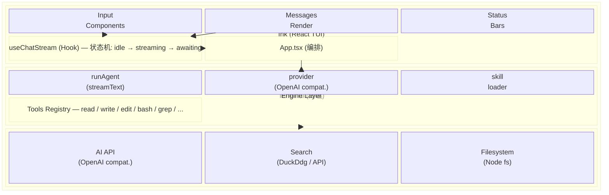

### 4.2 组件树

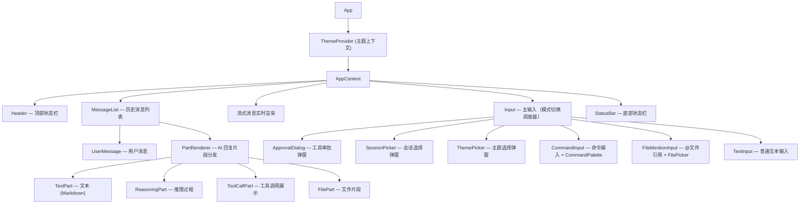

---

## 5. 启动流程

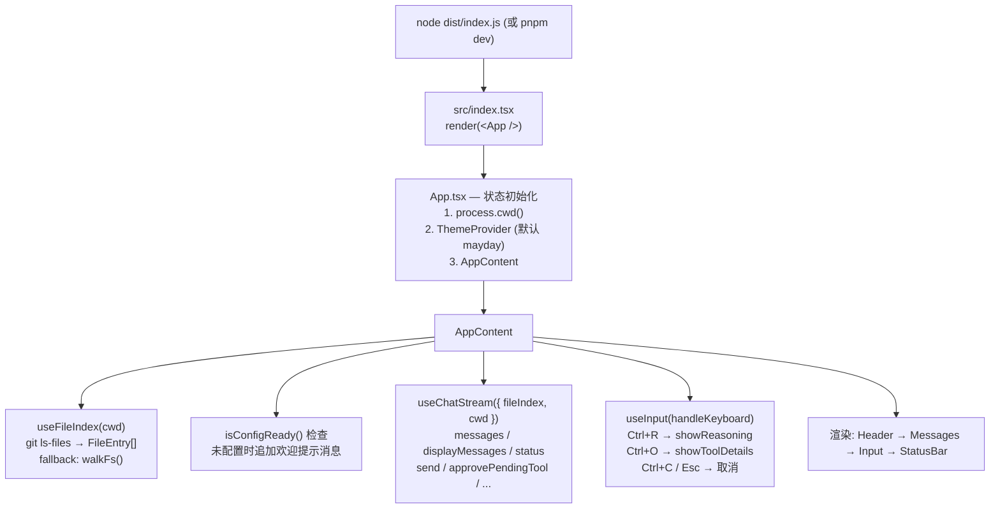

---

## 6. 配置系统

### 6.1 配置来源与优先级

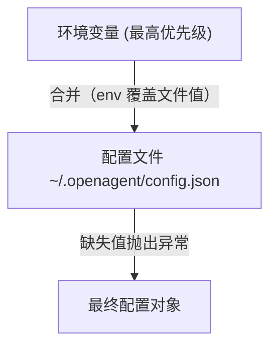

### 6.2 配置项

| 配置项     | 环境变量              | 必填 | 默认值 | 说明                                          |
| ---------- | --------------------- | ---- | ------ | --------------------------------------------- |
| `baseUrl`  | `OPENAGENT_BASE_URL`  | 是   | —      | OpenAI 兼容 API 的基础 URL                    |
| `apiKey`   | `OPENAGENT_API_KEY`   | 是   | —      | API 密钥                                      |
| `model`    | `OPENAGENT_MODEL`     | 是   | —      | 模型标识符                                    |
| `maxSteps` | `OPENAGENT_MAX_STEPS` | 否   | 20     | Agent 最大执行步数 (1-20)                     |
| `channels` | —                     | 否   | `[]`   | Channel 插件包名列表，如 `["@oagent/weixin"]` |

### 6.3 配置文件格式

```json
{
    "baseUrl": "https://api.example.com/v1",
    "apiKey": "sk-xxx",
    "model": "gpt-4o",
    "maxSteps": 20,
    "channels": ["@oagent/weixin"]
}
```

### 6.4 导出函数

```typescript
readEnvConfig(): OpenAgentConfig          // 读取环境变量中的配置（OPENAGENT_*）
isConfigReady(): boolean                  // 检查 baseUrl/apiKey/model 是否已配置
getApiKey(): string                       // 获取 API Key（必填，缺失抛异常）
getBaseUrl(): string                      // 获取基础 URL（必填，缺失抛异常）
getModelName(): string                    // 获取模型名（必填，缺失抛异常）
getMaxSteps(): number                     // 获取最大步数（默认 20，范围 1-20）
getConfiguredChannels(): string[]         // 获取已配置的 Channel 插件列表
getConfigSummary()                        // 获取配置摘要（API Key 脱敏：前4位...后4位）
saveConfig(config): void                  // 保存配置到文件
reloadConfig(): void                      // 重新加载配置
```

### 6.5 全局常量

- `APP_NAME = 'Open Agent'` — 应用名称
- `CONFIG_PATH` — 配置文件完整路径（`~/.openagent/config.json`）
- `MAX_FILE_SIZE = 1024 * 1024` — 文件读取和 grep 的大小上限（1MB）
- `DEFAULT_MAX_STEPS = 20` — 默认最大步数
- `SKIP_DIRS` — 文件索引和 grep/glob 时跳过的目录：`node_modules`, `.git`, `dist`, `.next`, `.coverage`, `.cache`, `out`

### 6.6 目录工具函数

`getOpenAgentDir()` 返回 `~/.openagent` 目录路径，所有读写该目录的代码统一使用此函数。

---

## 7. Engine 系统

### 7.1 概述

Engine 系统是 OpenAgent 的核心，负责与 AI 模型交互。它基于 Vercel AI SDK 的 `streamText` 实现流式文本生成和工具调用。Engine 模块位于 `packages/core/src/engine/`，包含四个子模块：

- **`engine/agents/`** — `runAgent()` 函数（核心 AI 循环）
- **`engine/tools/`** — 10 个内置工具 + 共享工具逻辑
- **`engine/skill/`** — 外部 Skill 加载（`~/.agents/skills`）
- **`engine/config/`** — Provider 配置和系统提示词生成

### 7.2 Provider

位于 `engine/config/provider.ts`，使用 `@ai-sdk/openai-compatible` 创建兼容 OpenAI API 的 provider：

```typescript
import { createOpenAICompatible } from '@ai-sdk/openai-compatible';

export function getProvider() {
    return createOpenAICompatible({
        name: 'custom',
        apiKey: getApiKey(),
        baseURL: getBaseUrl()
    });
}
```

### 7.3 runAgent

```typescript
export async function runAgent(messages: ModelMessage[], abortSignal?: AbortSignal, opts?: { maxRetries?: number }): Promise<ReturnType<typeof streamText>>;
```

核心调用逻辑：

```typescript
const result = streamText({
    model: getProvider()(getModelName()),
    stopWhen: stepCountIs(getMaxSteps()),
    system: getSystemPrompt(),
    messages,
    tools: {
        skill, // 动态 skill 工具（从 ~/.agents/skills/ 加载）
        ...tools // 10 个内置工具
    },
    abortSignal,
    maxRetries: opts?.maxRetries ?? 10,
    onError: ({ error }) => console.error('[runAgent] stream error:', error)
});
```

- **model**: 通过 provider 和配置的模型名创建
- **stopWhen**: 最多执行 `maxSteps` 步
- **system**: 系统提示词（每次调用时动态生成），包含基础提示和项目上下文（从 AGENTS.md 文件读取）
- **messages**: 对话历史
- **tools**: skill 工具 + 10 个内置工具（skill 在 runAgent 中动态注入，不在 tools 对象中静态定义）
- **abortSignal**: 支持用户取消
- **maxRetries**: 默认 10 次重试，可通过 opts 覆盖
- **onError**: 流式错误日志回调

系统提示词由 `system-prompt.ts` 的 `getSystemPrompt()` 函数动态生成，每次 `streamText` 调用时执行，包含两部分：

1. **基础提示**：描述 OA 的身份、能力和工作方式
2. **项目上下文**：从当前工作目录的 `AGENTS.md` 文件读取（如果存在），提供项目特定的指导信息

### 7.4 Skill 系统

```typescript
import { createSkillTool } from 'bash-tool';

const getSkill = async () => {
    const { skill } = await createSkillTool({
        skillsDirectory: path.join(os.homedir(), '.agents', 'skills')
    });
    return { skill };
};
```

Skills 存放在 `~/.agents/skills/` 目录下，使用 `bash-tool` 包的 `experimental_createSkillTool` 加载。

---

## 8. 工具系统

### 8.1 工具注册表

所有工具在 `packages/core/src/engine/tools/index.ts` 中注册：

```typescript
export const tools = {
    read_file: readFileTool,
    read_directory: readDirectoryTool,
    write_file: writeFileTool,
    edit_file: editFileTool,
    execute_bash: executeBashTool,
    grep: grepTool,
    glob: globTool,
    fetch: fetchTool,
    web_search: webSearchTool,
    ask_user_question: askUserQuestionTool
};
```

### 8.2 工具详细说明

#### read_file — 读取文件

| 属性 | 值                                                       |
| ---- | -------------------------------------------------------- |
| 参数 | `path: string`, `startLine?: number`, `endLine?: number` |
| 审批 | 无需                                                     |
| 限制 | 最大文件大小 1MB                                         |
| 返回 | `{ path, content, startLine, endLine, totalLines }`      |

#### read_directory — 读取目录

| 属性 | 值                                                         |
| ---- | ---------------------------------------------------------- |
| 参数 | `path: string`                                             |
| 审批 | 无需                                                       |
| 返回 | `{ path, entries: [{ name, isDirectory, isFile, path }] }` |

#### write_file — 写入文件

| 属性 | 值                                                       |
| ---- | -------------------------------------------------------- |
| 参数 | `path: string`, `content: string`, `overwrite?: boolean` |
| 审批 | **需要**                                                 |
| 返回 | `{ path, bytes, created, overwritten }`                  |

#### edit_file — 编辑文件

| 属性 | 值                                                                                  |
| ---- | ----------------------------------------------------------------------------------- |
| 参数 | `path: string`, `old_string: string`, `new_string: string`, `replace_all?: boolean` |
| 审批 | **需要**                                                                            |
| 验证 | `old_string` 必须存在且唯一（除非 `replace_all`）                                   |
| 返回 | `{ path, replacements, totalLines }`                                                |

#### execute_bash — 执行 Bash 命令

| 属性 | 值                                                 |
| ---- | -------------------------------------------------- |
| 参数 | `command: string`, `timeout?: number`              |
| 审批 | **动态判断**：只读命令无需审批，写入命令需要       |
| 限制 | 最大输出 1MB，默认超时 30s                         |
| 返回 | `{ command, exitCode, stdout, stderr, truncated }` |

**只读命令集** (`READONLY_COMMANDS`)：`ls`, `cat`, `grep`, `diff`, `find`（无 -exec）、`git`（只读子命令）、`npm list`、`node -v` 等 40+ 命令。

**危险命令模式** (`DANGEROUS_PATTERNS`)：

| 模式                  | 说明           |
| --------------------- | -------------- |
| `rm -rf /`            | 递归删除根目录 |
| `mkfs.*`              | 格式化磁盘     |
| `dd.*of=/dev/`        | 直接写入设备   |
| `sudo`                | 提权执行       |
| `su -`                | 切换用户       |
| `shutdown` / `reboot` | 关机/重启      |
| `:(){ ... }`          | Fork 炸弹      |
| `> /dev/sd`           | 覆盖磁盘设备   |

#### grep — 搜索文件内容

| 属性 | 值                                                                                                    |
| ---- | ----------------------------------------------------------------------------------------------------- |
| 参数 | `pattern`, `path`, `caseSensitive?`, `recursive?`, `glob?`, `context?`, `head_limit?`, `output_mode?` |
| 审批 | 无需                                                                                                  |
| 限制 | 最大 200 匹配，单文件最大 1MB                                                                         |
| 支持 | 正则表达式、上下文行、glob 过滤、三种输出模式                                                         |

#### glob — 文件匹配

| 属性 | 值                                 |
| ---- | ---------------------------------- |
| 参数 | `pattern: string`, `path?: string` |
| 审批 | 无需                               |
| 限制 | 最大 200 匹配                      |
| 支持 | `*`, `?`, `**` 通配符              |

#### fetch — HTTP 请求

| 属性 | 值                                               |
| ---- | ------------------------------------------------ |
| 参数 | `url`, `method?`, `headers?`, `body?`, `prompt?` |
| 审批 | 无需                                             |
| 安全 | SSRF 防护（阻止内网/本地地址）                   |
| 限制 | 最大响应 50KB                                    |
| 特性 | `prompt` 参数支持关键词聚焦                      |

#### web_search — 网络搜索

| 属性 | 值                                                                                                 |
| ---- | -------------------------------------------------------------------------------------------------- |
| 参数 | `query: string`, `max_results?: number` (最大 10，默认 5)                                          |
| 审批 | 无需                                                                                               |
| 后端 | (1) 配置 API (`OPENAGENT_SEARCH_API_URL`/`OPENAGENT_SEARCH_API_KEY`) <br> (2) DuckDuckGo HTML 抓取 |
| 返回 | `{ query, results: [{ title, url, snippet }], provider }`                                          |

#### ask_user_question — 向用户提问

| 属性 | 值                                                                  |
| ---- | ------------------------------------------------------------------- |
| 参数 | `question: string`, `options: string[]` (2-4 个), `header?: string` |
| 审批 | **需要**                                                            |
| 返回 | `{ question, options, header, status: 'awaiting_user_selection' }`  |

### 8.3 工具审批流程

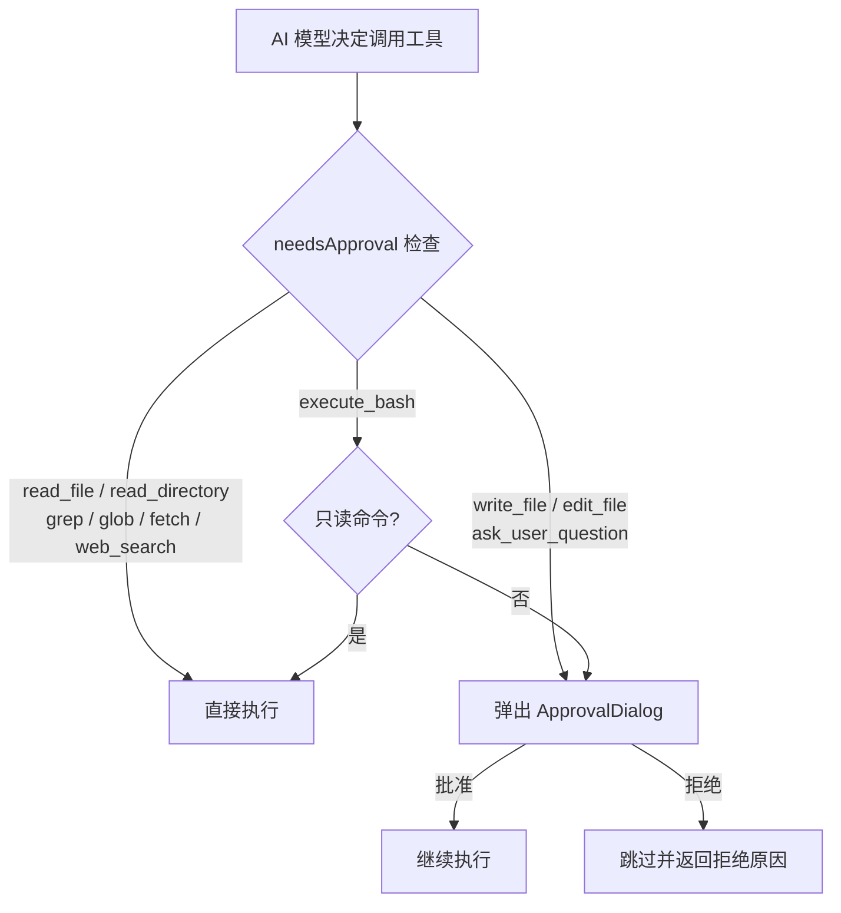

---

## 9. 命令系统

### 9.1 命令接口

```typescript
interface SlashCommand {
    name: string; // 如 '/help'
    description: string; // 人类可读描述
    run: (ctx: CommandContext) => void | Promise<void>;
}
```

### 9.2 CommandContext

命令执行时接收的上下文对象，包含应用状态和回调：

```typescript
interface CommandContext {
    rawInput: string; // 原始输入
    args: string[]; // 解析后的参数
    cwd: string; // 当前工作目录
    fileIndexCount: number; // 索引文件数
    messages: ModelMessage[]; // 当前对话消息
    displayMessages: UIMessage[]; // 当前 UI 消息
    pendingApproval: boolean; // 是否有待审批
    appendMessages: (items) => void; // 追加消息
    setSession: (msgs, display) => void; // 设置会话
    resetSession: () => void; // 重置会话
    saveCurrentSession: () => Promise<void>; // 保存会话
    cancelResponse: () => void; // 取消响应
    reloadFileIndex: () => Promise<number>; // 重新加载文件索引
    exit: () => void; // 退出
    listCommands: () => SlashCommand[]; // 列出命令
    showSessionPicker: (sessions) => void; // 显示会话选择器
    themeName: ThemeName; // 当前主题名
    setThemeName: (name) => void; // 设置主题
    showThemePicker: () => void; // 显示主题选择器
    showConfigPicker: () => void; // 显示配置选择器
}
```

### 9.3 命令解析流程

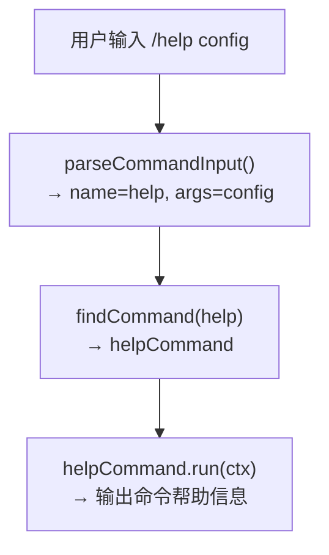

### 9.4 全部命令

| 命令              | 说明                                                  |
| ----------------- | ----------------------------------------------------- |
| `/help [命令名]`  | 列出所有命令，或显示指定命令的帮助                    |
| `/status`         | 显示 cwd、文件索引数、消息数、审批状态                |
| `/config`         | 打开配置选择器，编辑配置文件                          |
| `/approvals`      | 管理工具审批偏好（execute_bash/write_file/edit_file） |
| `/theme [主题名]` | 打开主题选择器或直接设置主题                          |
| `/tools`          | 列出所有内置工具名                                    |
| `/channel`        | 管理消息渠道（start/stop/login/logout/status）        |
| `/reload`         | 重新扫描工作目录，刷新文件索引                        |
| `/cancel`         | 停止当前流式响应                                      |
| `/sessions`       | 列出并恢复已保存会话                                  |
| `/clear`          | 保存当前会话后重置                                    |
| `/exit`           | 保存会话、停止所有渠道、退出 TUI                      |

---

## 10. Hook 系统

### 10.1 useChatStream

核心聊天状态机，管理对话的完整生命周期。

#### 状态机

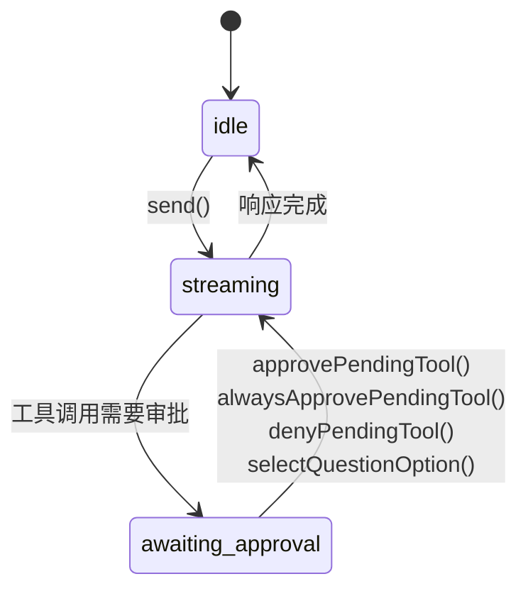

#### 导出接口

```typescript
interface UseChatStreamResult {
    messages: ModelMessage[]; // 模型对话历史
    displayMessages: UIMessage[]; // UI 展示消息
    status: ChatStatus; // 'idle' | 'streaming' | 'awaiting_approval'
    usage: UsageInfo | null; // token 使用统计
    modelId: string; // 模型 ID
    pendingApproval: PendingToolApproval | null; // 待审批工具信息
    send: (text: string) => Promise<void>; // 发送消息
    approvePendingTool: () => Promise<void>; // 批准待审批工具
    alwaysApprovePendingTool: () => Promise<void>; // 批准并记住偏好
    denyPendingTool: (reason?) => Promise<void>; // 拒绝待审批工具
    selectQuestionOption: (option) => Promise<void>; // 选择问题选项
    appendMessages: (items) => void; // 追加消息
    setSession: (msgs, display) => void; // 设置会话
    reset: () => void; // 重置
    cancel: () => void; // 取消
}
```

#### 流式事件处理

AI SDK 的流包含 13 种事件类型：

| 事件                    | 处理方式                      |
| ----------------------- | ----------------------------- |
| `text-start`            | 创建新的文本 part             |
| `text-delta`            | 追加文本增量                  |
| `text-end`              | 标记文本完成                  |
| `reasoning-start`       | 创建推理 part                 |
| `reasoning-delta`       | 追加推理增量                  |
| `reasoning-end`         | 标记推理完成                  |
| `tool-input-start`      | 创建工具调用 part             |
| `tool-input-delta`      | 追加工具参数增量              |
| `tool-input-available`  | 工具参数完整可用              |
| `tool-approval-request` | 设置 `awaiting_approval` 状态 |
| `tool-input-error`      | 工具参数解析错误              |
| `tool-output-available` | 工具执行结果可用              |
| `tool-output-error`     | 工具执行错误                  |
| `tool-output-denied`    | 工具调用被拒绝                |
| `file`                  | 文件附件                      |
| `error`                 | 通用错误                      |

#### send() 流程

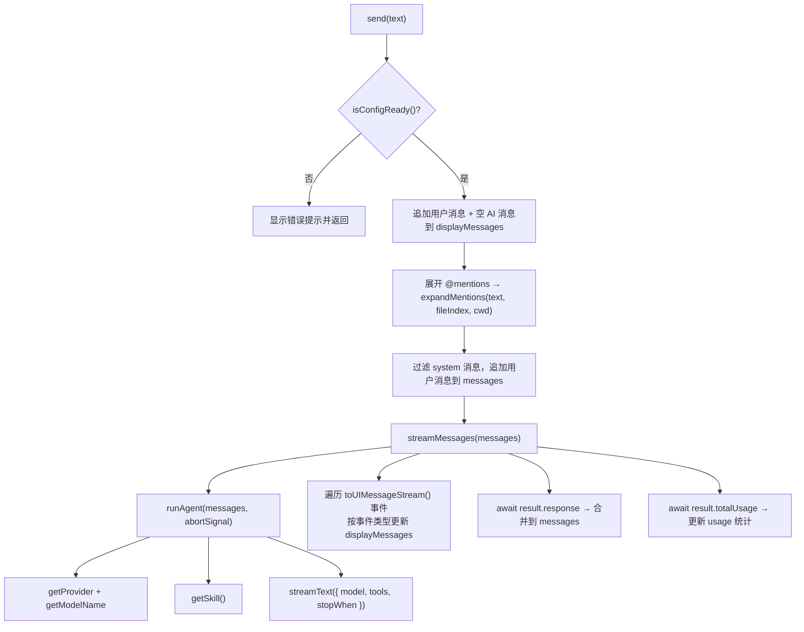

### 10.2 useFileIndex

```typescript
interface UseFileIndexResult {
    fileIndex: FileEntry[]; // 文件条目列表
    status: FileIndexStatus; // 'indexing' | 'ready' | 'error'
    reload: () => Promise<number>; // 手动刷新
}
```

- 组件挂载时异步加载 `loadFileIndex(cwd)`
- 支持 `reload()` 手动刷新
- 通过 `cancelled` 标志实现安全取消

---

## 11. UI 组件体系

### 11.1 Input 组件（模式切换调度器）

Input 组件通过 `useInputMode` hook 管理输入模式状态机，模式判断优先级从高到低：

`InputMode = 'approval' | 'session' | 'theme' | 'config' | 'disabled' | 'command' | 'file' | 'text'`

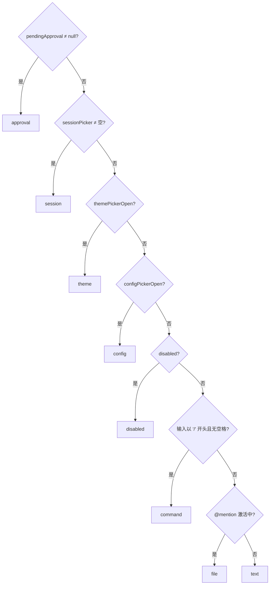

覆盖层模式（`approval` / `session` / `theme` / `config`）统一由 `OverlaySlot` 组件分发：

- `approval` → `ApprovalDialog`
- `session` → `SessionPicker`
- `theme` → `ThemePicker`
- `config` → `ConfigPicker`

#### 审批对话框 (ApprovalDialog)

标准工具审批有三种选项（上下键选择，Enter 确认）：

| 选项             | 行为                                              |
| ---------------- | ------------------------------------------------- |
| 批准执行         | 调用 `approvePendingTool()`，批准本次调用         |
| 始终批准此类操作 | 调用 `alwaysApprovePendingTool()`，写入偏好并批准 |
| 拒绝             | 调用 `denyPendingTool()`，拒绝本次调用            |

`ask_user_question` 工具显示问题选项列表，支持自定义输入（选择"✏️ 自定义输入..."后进入 TextInput 模式）。

### 11.2 MessageList

```typescript
interface MessageListProps {
    messages: UIMessage[]; // UI 消息列表
    showReasoning: boolean; // 是否显示推理过程
    showToolDetails: boolean; // 是否展开工具调用详情
}
```

- 使用 `React.memo` 优化渲染
- 遍历每条消息，用户消息渲染 `UserMessage`，AI 消息遍历 parts 渲染 `PartRenderer`

### 11.3 PartRenderer 与工具调用分组

`PartRenderer` 按 `part.type` 分发到具体渲染器。在渲染前，parts 经过 `groupToolParts` 函数分组：

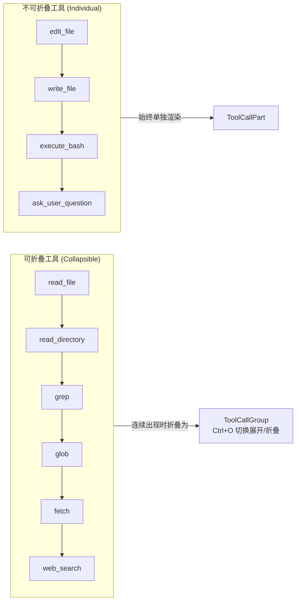

> 分组逻辑：连续的可折叠工具合并为一个 ToolCallGroup（中间跳过 reasoning 片段），Ctrl+O 切换展开/折叠状态。

| part.type                        | 渲染组件                           | 说明                    |
| -------------------------------- | ---------------------------------- | ----------------------- |
| `text`                           | `TextPart` → `Markdown`            | 文本内容，支持 Markdown |
| `reasoning`                      | `ReasoningPart` → `Markdown`       | 推理过程（暗色显示）    |
| `dynamic-tool` (单个)            | `ToolCallPart`                     | 单个工具调用及结果      |
| `dynamic-tool` (分组)            | `ToolCallGroup` → `ToolCallPart[]` | 多工具调用折叠展示      |
| `file` / `source` / `source-url` | `FilePart`                         | 文件片段                |

### 11.4 ToolCallPart 状态图标

| 状态                             | 图标 | 含义         |
| -------------------------------- | ---- | ------------ |
| `input-streaming`                | `⋯`  | 正在接收参数 |
| `input-available`                | `○`  | 参数就绪     |
| `approval-requested`             | `◔`  | 等待用户审批 |
| `approval-responded`             | `◉`  | 已审批       |
| `output-available`               | `●`  | 结果可用     |
| `output-error` / `output-denied` | `▲`  | 错误或被拒绝 |

### 11.5 Markdown 渲染

`Markdown.tsx` 支持的元素：

- 段落、标题 (h1-h6)
- 代码块（带语法高亮）
- 行内代码
- 有序/无序列表（支持嵌套）
- 引用块
- 水平分割线
- 表格（自适应终端宽度）
- 粗体、斜体、删除线、链接、图片

性能优化：快速路径检测 — `hasMarkdownSyntax()` 为 false 时直接渲染纯文本。

### 11.6 MarkdownTable

- 自动适应终端宽度
- 当行内容需要超过 4 行换行时，回退为垂直（key-value）布局
- 使用 ANSI 转义序列直接渲染（非逐单元格 React 组件），提高性能

---

## 12. 主题系统

### 12.1 主题定义

```typescript
interface Theme {
    accent: string; // 强调色
    accentDim: string; // 暗强调色
    suggestion: string; // 建议色
    success: string; // 成功色
    warning: string; // 警告色
    error: string; // 错误色
    inactive: string; // 非活跃色
    subtle: string; // 微妙色
    text: string; // 文本色
    textDim: string; // 暗文本色
    border: string; // 边框色
    surface: string; // 表面色
    syntax: SyntaxColors; // 语法高亮色
}

interface SyntaxColors {
    keyword: string;
    string: string;
    comment: string;
    function: string;
    number: string;
    type: string;
    operator: string;
    punctuation: string;
}
```

### 12.2 内置主题

| 主题     | 风格                                                                     |
| -------- | ------------------------------------------------------------------------ |
| `dark`   | VS Code 暗色风格                                                         |
| `light`  | VS Code 亮色风格                                                         |
| `mayday` | 五月天配色（蓝强调、橙辅助、绿成功、黄警告、红错误、粉建议）**默认主题** |

### 12.3 主题使用

```typescript
// 提供主题上下文，默认主题为 'mayday'
<ThemeProvider>
    <AppContent />
</ThemeProvider>

// 在组件中使用
const { theme, themeName, setThemeName, toggleTheme } = useTheme();

// ThemedText — 自动解析主题色名
<ThemedText color="accent">强调文字</ThemedText>

// ThemedBox — 自动解析边框和背景色
<ThemedBox borderColor="border" backgroundColor="surface">...</ThemedBox>
```

### 12.4 颜色解析

```typescript
resolveColor('accent', theme); // → theme.accent (hex)
resolveColor('#ff0000', theme); // → '#ff0000' (直接返回)
resolveColor(undefined, theme); // → undefined
```

---

## 13. 工具函数

### 13.1 files.ts — 文件索引

```typescript
interface FileEntry {
    path: string;       // 相对于 cwd 的路径
    type: 'file' | 'dir';
}

// 加载文件索引：优先 git ls-files，回退 walkFs()
loadFileIndex(cwd: string): Promise<FileEntry[]>

// 模糊匹配文件：基于评分排序
filterFiles(index: FileEntry[], query: string, limit?: number): FileEntry[]

// 检测 @mention 激活
getActiveMention(value: string): { start: number; query: string } | null

// 展开 @mentions：替换为 <file path="...">content</file>
expandMentions(text: string, index: FileEntry[], cwd: string): Promise<string>
```

**模糊匹配评分规则**（从高到低）：

1. 精确词干匹配
2. 精确文件名匹配
3. 文件名以 query 开头
4. 词干以 query 开头

### 13.2 safe-path.ts — 路径安全

```typescript
const ROOT_DIR = path.resolve(process.env.OPENAGENT_WORK_DIR || process.cwd());

// 写入路径解析：阻止目录穿越和符号链接逃逸
resolveSafePath(relPath: string): string

// 读取路径解析：不做工作目录限制，相对路径基于 ROOT_DIR 解析
resolveReadPath(filePath: string): string
```

- `resolveSafePath`：检查路径是否在 ROOT_DIR 内，使用 `fs.realpathSync` 检测符号链接逃逸，拒绝 `..` 路径穿越（用于写入操作）
- `resolveReadPath`：不做工作目录限制，允许读取任意路径（用于只读操作）
- `ROOT_DIR` 支持通过 `OPENAGENT_WORK_DIR` 环境变量覆盖（用于微信机器人等子进程场景）

### 13.3 sessions.ts — 会话持久化

```typescript
interface SavedSession {
    version: number; // 版本号（当前 1）
    sessionId: string; // 会话 ID
    savedAt: string; // ISO 时间戳
    cwd: string; // 绝对路径
    branch: string; // Git 分支或 'default'
    displayMessages: UIMessage[];
}
```

**存储路径**：`~/.openagent/sessions/<sessionId>.json`

- 每个会话一个 JSON 文件，以 sessionId 命名
- 历史记录追加到 `~/.openagent/history.jsonl`（JSONL 格式，每行一条记录）
- `listSessions()` 读取 history.jsonl，按 sessionId 分组，过滤掉仅含命令的空会话

### 13.4 highlight.ts — 语法高亮

基于单一正则表达式的语法高亮器，支持：

- 注释：JS `//`、Python `#`、C `/* */`
- 字符串：单引号、双引号、反引号
- 数字
- 关键字：JS + Python
- 类型名：PascalCase
- 函数名：后跟 `(` 的标识符
- 标点和运算符

### 13.5 markdown.ts — Markdown 处理

```typescript
// 快速检测是否包含 Markdown 语法（检查前 500 字符）
hasMarkdownSyntax(text: string): boolean

// 使用 marked 词法分析器解析 Markdown
lexMarkdown(text: string): Token[]
```

### 13.6 summarize-args.ts — 参数摘要

将工具参数对象转换为 `key=value` 格式的摘要字符串，值超过 40 字符时截断。用于 UI 中工具调用的简洁展示。

### 13.7 uid.ts — 唯一 ID

```typescript
import { randomUUID } from 'node:crypto';
export const uid = randomUUID;
```

### 13.8 errors.ts — 错误信息提取

```typescript
// 从 unknown 错误中提取可读的错误信息
getErrorMessage(error: unknown): string
```

统一处理 `catch (error)` 中 error 类型不确定的场景，替代重复的 `error instanceof Error ? error.message : String(error)`。

### 13.9 exec.ts — 共享命令执行

```typescript
import { execFile } from 'node:child_process';
import { promisify } from 'node:util';
export const execFileAsync = promisify(execFile);
```

`files.ts` 和 `sessions.ts` 共用的 `execFile` promisify 封装。

### 13.10 fs.ts — 文件系统工具

```typescript
// 确保目录存在（同步/异步）
ensureDirSync(dir: string): void
ensureDir(dir: string): Promise<void>

// 读取 JSON 文件，不存在或解析失败时返回 null
readJsonFile<T>(filePath: string): T | null

// 写入 JSON 文件，自动创建父目录
writeJsonFile(filePath: string, data: unknown, indent?: number): void
```

`config/index.ts` 和 `approval-store.ts` 的文件读写统一使用这些函数。

### 13.11 walk.ts — 目录遍历

```typescript
interface WalkEntry {
    relativePath: string;  // 相对于基准目录的路径
    fullPath: string;      // 绝对路径
    entry: Dirent;         // fs.Dirent 对象
}

// 异步目录遍历生成器
walkDirectory(dir, baseDir, options?): AsyncGenerator<WalkEntry>
```

统一 `grep`、`glob`、`files.ts` 的目录遍历逻辑：

- 自动过滤 `SKIP_DIRS` 和隐藏文件（`filterHidden` 可配置）
- 通过 `shouldRecurse` 控制是否递归子目录
- yield 所有条目（文件和目录），调用方按需过滤

---

## 14. 数据流详解

### 14.1 用户输入 → AI 响应

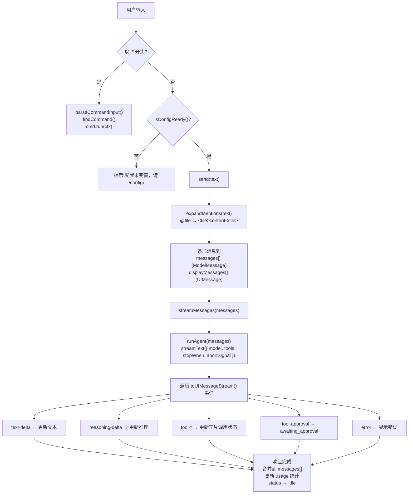

### 14.2 工具审批流程

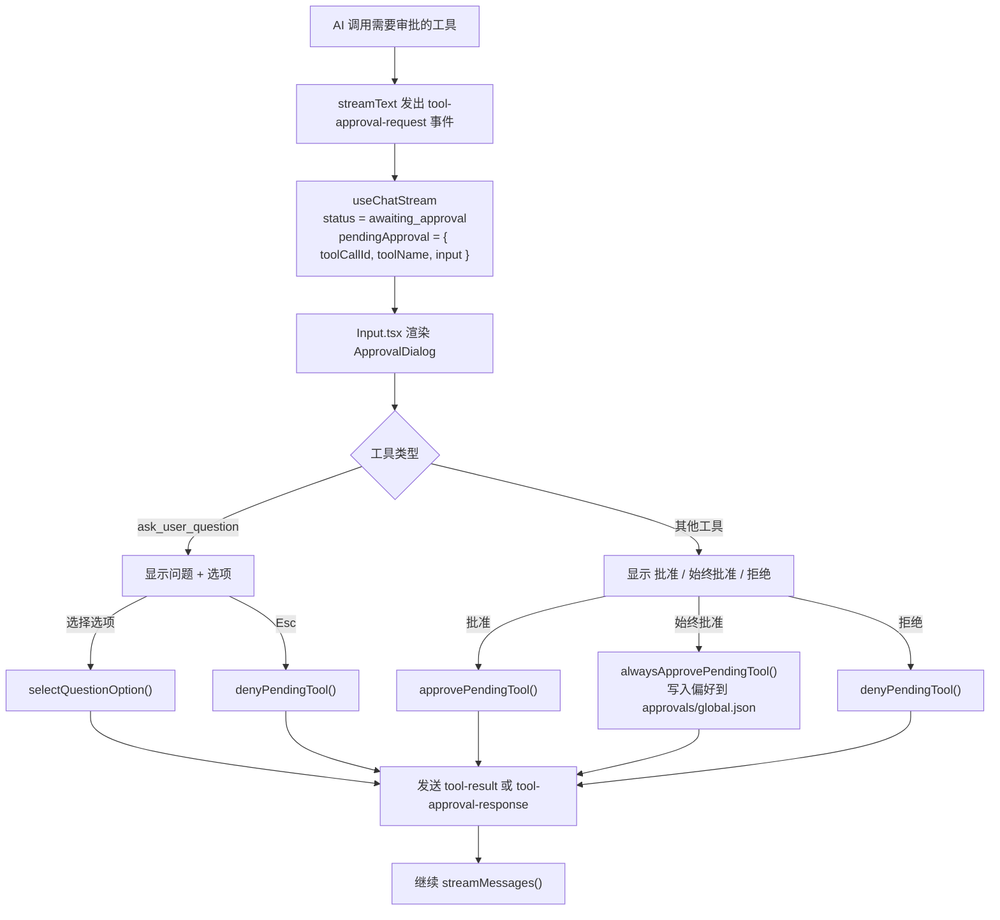

### 14.3 会话持久化流程

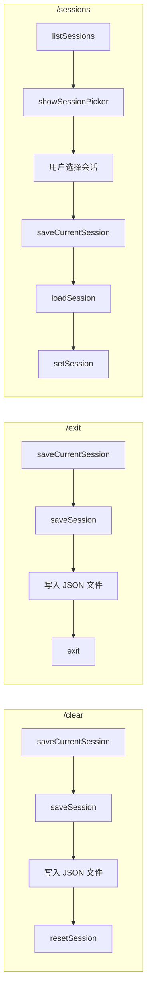

### 14.4 @ 文件引用流程

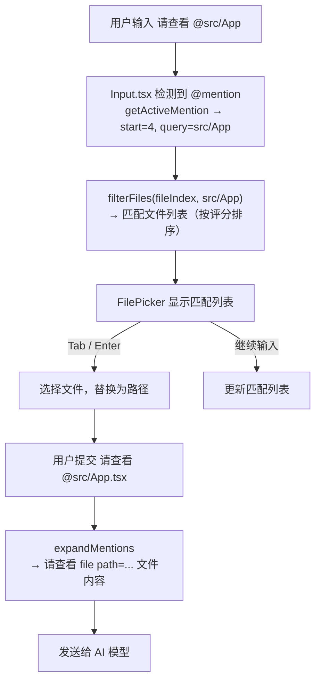

### 14.5 双消息状态

系统维护两个并行的消息数组：

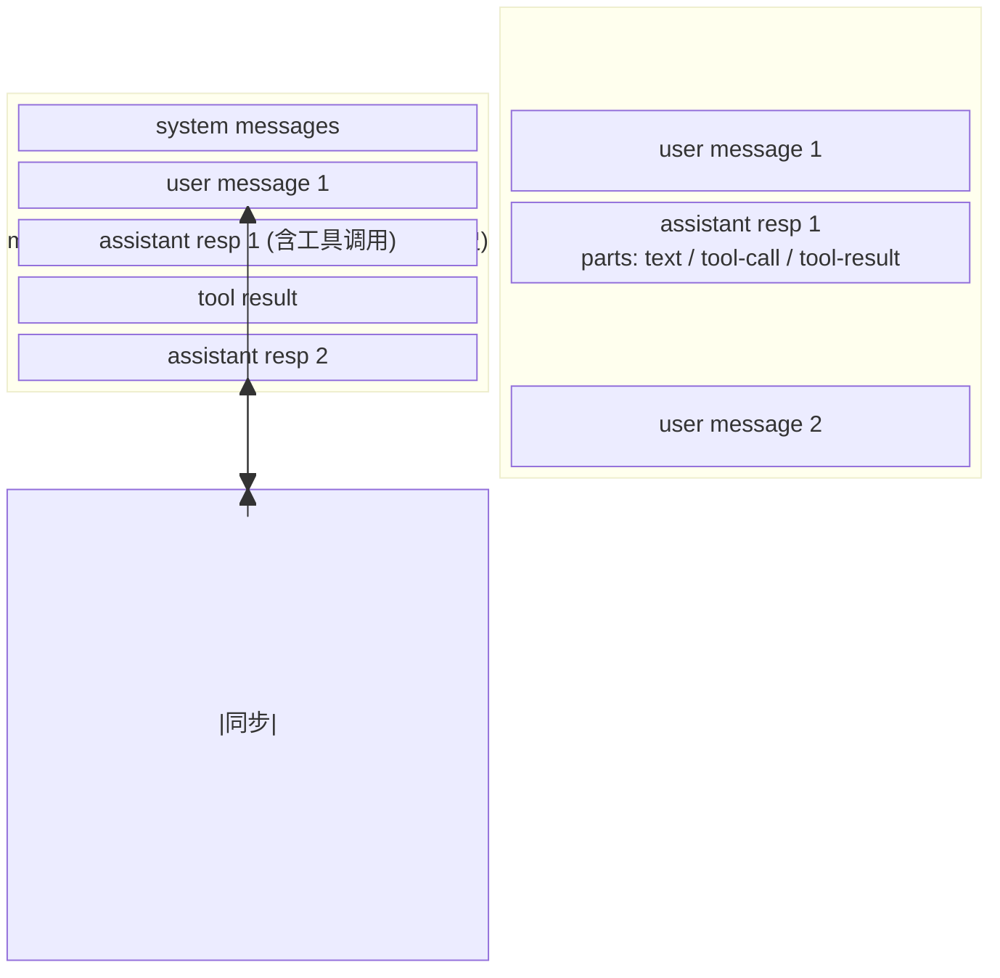

- `messages` 来源：AI 模型，用途：发送给模型
- `displayMessages` 来源：UI 实时更新，用途：渲染给用户
- 用户输入同时写入两者，AI 响应完成后合并到 `messages`，流式更新 `displayMessages`

- `messages` 是 AI 的对话真相，发送给模型
- `displayMessages` 是 UI 的展示真相，实时渲染
- 用户输入同时写入两者
- AI 响应完成后合并到 `messages`，流式更新 `displayMessages`

---

## 15. 安全机制

### 15.1 路径安全

- **目录穿越防护**：`resolveSafePath()` 阻止 `..` 路径穿越
- **符号链接防护**：检查 `realpath` 是否仍在工作目录内
- **工作目录沙箱**：所有文件操作限制在 `process.cwd()` 内

### 15.2 命令执行安全

- **只读/写入分离**：`READONLY_COMMANDS` 集合区分安全命令
- **危险模式检测**：`DANGEROUS_PATTERNS` 阻止破坏性命令
- **动态审批**：写入类命令需要用户确认
- **超时限制**：默认 30 秒超时
- **输出限制**：最大 1MB 输出

### 15.3 网络安全

- **SSRF 防护**：`fetch` 工具阻止 localhost 和内网地址
    - 阻止 `127.0.0.0/8`、`10.0.0.0/8`、`172.16.0.0/12`、`192.168.0.0/16`
    - 阻止 `169.254.0.0/16`（链路本地）
    - 阻止 IPv6 私有地址
    - DNS 解析检查
- **响应大小限制**：最大 50KB

### 15.4 文件大小限制

- 读取文件：最大 1MB
- grep 匹配：最大 200 条，单文件最大 1MB
- glob 匹配：最大 200 条
- 文件索引：最大 5000 条目

### 15.5 配置安全

- API Key 在 `/config` 输出中脱敏显示（前 4 位 + `...` + 后 4 位）
- 配置文件存储在用户主目录 `~/.openagent/`，不提交到项目仓库

---

## 16. 构建与开发

### 16.1 开发命令

```bash
pnpm install          # 安装依赖
pnpm start            # 运行（tsx packages/core/src/index.tsx）
pnpm build            # 递归编译所有子包
pnpm lint             # ESLint 检查
pnpm lint:fix         # ESLint 自动修复
pnpm typecheck        # TypeScript 类型检查（递归所有子包）
pnpm test             # 运行测试
pnpm format           # Prettier 格式化
pnpm pack:dry         # 本地打包预检
pnpm version:all patch # 统一升级版本号（patch/minor/major）
pnpm publish:all       # 发布所有包（自动检查版本一致性）
pnpm publish:channels  # 单独发布 @oagent/channels
pnpm publish:weixin    # 单独发布 @oagent/weixin
```

### 16.2 构建配置

各子包使用独立的 `tsup.config.ts`，统一构建参数：

| 参数     | 值      | 说明            |
| -------- | ------- | --------------- |
| 格式     | ESM     | ES Module 输出  |
| 平台     | Node    | Node.js 运行时  |
| 目标     | Node 22 | 最低支持版本    |
| 代码拆分 | 关闭    | 单文件输出      |
| 输出目录 | dist/   | 各子包独立 dist |

`pnpm build` 按依赖顺序递归构建：`@oagent/channels` → `@oagent/core` → `@oagent/weixin`。

### 16.3 开发工具链

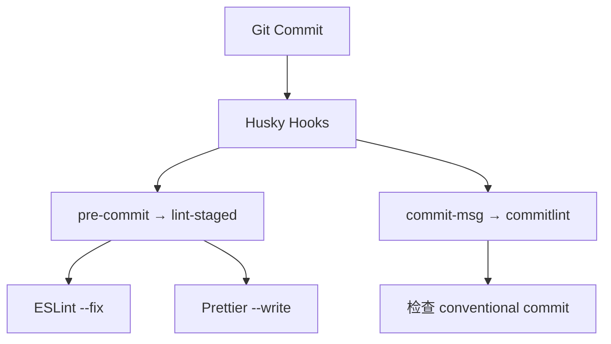

### 16.4 TypeScript 配置

- Target: `ES2022`
- Module: `ESNext`
- Module Resolution: `bundler`
- JSX: `react-jsx`
- 路径别名: `@/*` → `./packages/core/src/*`
- 各子包有独立 `tsconfig.json`，通过 `references` 关联

---

## 17. 扩展指南

### 17.1 添加新命令

1. 在 `packages/core/src/commands/` 下创建新文件
2. 实现 `SlashCommand` 接口：

```typescript
import { SlashCommand } from './registry';

const myCommand: SlashCommand = {
    name: '/mycommand',
    description: '命令描述',
    run: (ctx) => {
        // ctx 包含应用状态和回调
        ctx.appendMessages([
            {
                id: uid(),
                role: 'assistant',
                parts: [{ type: 'text', text: '命令执行结果' }]
            }
        ]);
    }
};

export default myCommand;
```

3. 在 `packages/core/src/commands/index.ts` 的 `COMMANDS` 数组中注册

### 17.2 添加新工具

1. 在 `packages/core/src/engine/tools/` 下创建新文件
2. 使用 AI SDK 的 `tool({...})` 定义：

```typescript
import { tool } from 'ai';
import { z } from 'zod';

export const myTool = tool({
    description: '工具描述',
    parameters: z.object({
        param1: z.string().describe('参数描述'),
        param2: z.number().optional()
    }),
    execute: async ({ param1, param2 }) => {
        // 工具逻辑
        return { result: 'success' };
    }
});
```

3. 在 `packages/core/src/engine/tools/index.ts` 的 `tools` 对象中注册

> **注意**：审批逻辑由 AI SDK 内置机制处理，不需要在工具定义中设置 `needsApproval`。需要审批的工具在 `useChatStream` 中通过 `tool-approval-request` 事件触发。审批偏好持久化在 `approval-store.ts` 中管理，支持 `execute_bash`、`write_file`、`edit_file` 三个工具的偏好设置。审批文件存储在 `~/.openagent/approvals/` 目录下：TUI 全局使用 `global.json`，每个 Channel 使用独立的 `{channelId}.json`（如 `weixin.json`），通过 `AsyncLocalStorage` 上下文隔离实现互不干扰。

### 17.3 添加新主题

在 `packages/core/src/ui/text/theme.tsx` 的 `themes` 对象中添加新主题定义：

```typescript
export const themes: Record<ThemeName, Theme> = {
    // ... 现有主题
    mytheme: {
        accent: '#ff6600',
        accentDim: '#cc5200',
        // ... 其他颜色
        syntax: {
            /* ... */
        }
    }
};
```

然后更新 `ThemeName` 类型：

```typescript
export type ThemeName = 'dark' | 'light' | 'mayday' | 'mytheme';
```

### 17.4 开发 Channel 插件

Channel 插件用于接入消息平台（微信、Telegram 等），实现远程与 AI 对话。

#### 架构

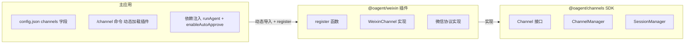

#### 创建插件包

1. 创建 npm 包，依赖 `@oagent/channels`
2. 导出 `register` 函数：

```typescript
// packages/my-channel/src/index.ts
import type { ChannelManager } from '@oagent/channels';
import type { RunAgentFn } from './types.js';

export function register(manager: ChannelManager, opts: { runAgent: RunAgentFn }): void {
    manager.register(new MyChannel(opts));
}
```

3. 实现 `Channel` 接口：

```typescript
import type { Channel, ChannelStartOpts, ChannelStatus } from '@oagent/channels';

export class MyChannel implements Channel {
    readonly id = 'my-channel';
    readonly name = 'My Channel';
    status: ChannelStatus = 'idle';

    isConfigured(): boolean {
        // 检查是否已配置（如 token 是否存在）
        return true;
    }

    getStatusInfo(): string[] {
        return ['状态信息'];
    }

    async start(opts: ChannelStartOpts): Promise<void> {
        this.status = 'running';
        try {
            // 启动消息监控
            // 收到消息时调用 opts.onMessage({ type, channelId, userId, text })
            // 使用 opts.runAgent 调用 AI
        } finally {
            this.status = 'idle';
        }
    }

    async stop(): Promise<void> {
        this.status = 'idle';
    }
}
```

#### 依赖注入

插件通过 `register` 函数的 `opts` 参数接收宿主应用的能力：

| 参数                | 类型                        | 说明             |
| ------------------- | --------------------------- | ---------------- |
| `runAgent`          | `(messages, signal) => ...` | 调用 AI Agent    |
| `enableAutoApprove` | `() => Promise<void>`       | 启用工具自动审批 |

#### 使用插件

1. 安装插件：`pnpm add @oagent/my-channel`
2. 配置 `~/.openagent/config.json`：

```json
{
    "channels": ["@oagent/my-channel"]
}
```

3. TUI 中使用：`/channel start my-channel`
